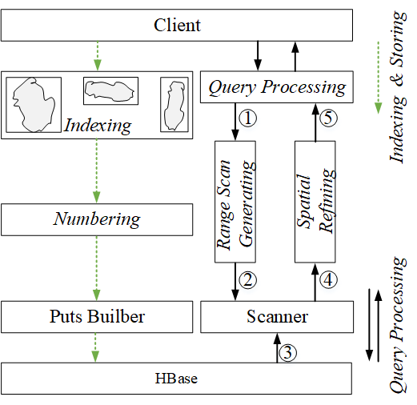
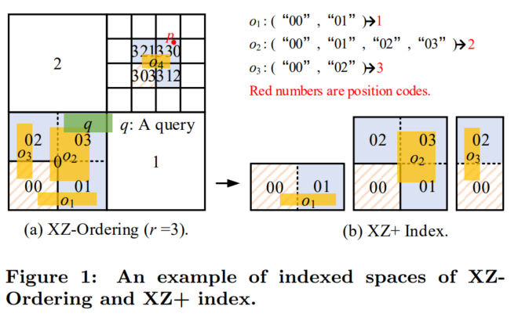
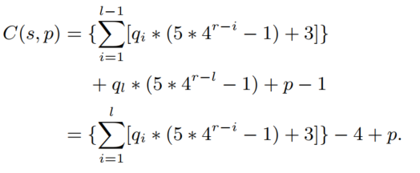

# XZ+HBase
we developed an opensource toolkit XZ+HBase [https://github.com/huajunge/XZPlusHBase] by integrating the XZ+ index into HBase for managing non-point spatial objects. 

### 1 Framework



### 1.1 Indexing



we propose a fine-grained static index for non-point spatial objects, i.e., XZ+. It adopts new index spaces to distinguish the different objects covered in the same enlarged element of XZ￾Ordering. For example, in Figure 1(a), o1, o2 and o3 have the same representative “00” using XZ-Ordering, but XZ+ method will assign different indexed spaces to them, e.g., as shown in Figure 1(b), we use three indexed spaces to en￾code o1, o2 and o3, respectively. However, it is redundant for the database to store the object under each intersecting sub-space, requiring storing extra copies of the object that may cause much storage overhead. Therefore, we propose the concept of position code, which uses one integer value to represent a non-point object’s relative position in the enlarged element. For examples, as shown in Figure 1(b), in￾stead of two sub-spaces (“00” and “01”), we use the position code 1 to represent o1. Similarly, o2 is represented by the
position code 2, o3 is represented by 3. Then, we only need to store the object with its position code once.

### 1.2 Numbering



The numbering function is shown in above figure. Our solution is to number the quadrant sequence and position code into the integer domain with lexicographical order. Our numbering solution guarantees that the less-equal-order of the generated integer values must correspond to the indexed spaces’ lexicographical ordering. Therefore, spatially close objects can be covered by as few minimalist integer ranges as possible. 

### 1.3 Key

Key: Shard + XZ+ value + id


### 2 Example

### 2.1 API

1. Init client

```
 HBaseClient(String tableName, Short precise);
 HBaseClient(String tableName, Short precise, XZ2SFC sfc);
```

2. Insert 

```
void insert(String id, String geom, String value)
```

3. Range Query

```
List<Result> rangeQuery(Double minLng, Double minLat, Double maxLng, Double maxLat)
```

### 2.2 Example

```
public class HBaseClientExample {
    public static void main(String[] args) throws IOException, InterruptedException {
        String[] mbr = "106.65618,26.61497,106.68118,26.63997".split(",");
        String tableXZP = "xzp1";
        String tableXZ = "xz1";
        String tableXZB = "xzb1";
        String tableXZS = "xzs1";
        Short precision = 15;
        double lat = 26.21497;
        double lon = 106.25618;
        XZ2SFC xz2SFC = XZ2SFC.apply((short) 16);
        XZPlusSFC xzPlusSFC = XZPlusSFC.apply((short) 16);
        HBPlusSFC hilbertSFC = HBPlusSFC.apply((short) 16);

        for (int i = 12; i <= 17; i++) {
            try (HBaseClient hBaseClient = new HBaseClient(tableXZ + "_" + i, (short) 16, xz2SFC)) {
                Random random = new Random(1000000);
                Random randomLat = new Random(2661497);
                for (int k = 0; k < 5000; k++) {
                    for (int j = 1; j <= 5; j++) {
                        double offset = random.nextDouble() * 0.5;
                        double offsetLat = randomLat.nextDouble() * 0.5;
                        //System.out.println(String.format("%s_%s", offset, m));
                        MinimumBoundingBox mbr2 = new MinimumBoundingBox(lon + offset, lat + offsetLat, lon + offset + j * 0.005, lat + offsetLat + j * 0.005);
                        //System.out.println(String.format("%s", mbr2.toPolygon(4326).toText()));
                        hBaseClient.batchInsert((k * 5 + j) + "", mbr2.toPolygon(4326).toText(), mbr2.toPolygon(4326).toText());
                    }
                }
                hBaseClient.finishBatchPut();
                long time = System.currentTimeMillis();
                List<Result> resultList = hBaseClient.rangeQuery(106.64618, 26.60497, 106.69118, 26.64997);
                System.out.println(resultList.size());
                System.out.println(System.currentTimeMillis() - time);
                System.out.println("----------");
            } catch (InterruptedException e) {
                e.printStackTrace();
            }
        }

        try (HBaseClient hBaseClient = new HBaseClient(tableXZS, (short) 16, xzPlusSFC)) {
            Random random = new Random(1000000);
            Random randomLat = new Random(2661497);
            for (int k = 0; k < 50000; k++) {
                for (int j = 1; j <= 5; j++) {
                    double offset = random.nextDouble() * 0.5;
                    double offsetLat = randomLat.nextDouble() * 0.5;
                    //System.out.println(String.format("%s_%s", offset, m));
                    MinimumBoundingBox mbr2 = new MinimumBoundingBox(lon + offset, lat + offsetLat, lon + offset + j * 0.005, lat + offsetLat + j * 0.005);
                    //System.out.println(String.format("%s", mbr2.toPolygon(4326).toText()));
                    hBaseClient.sbatchInsert((k * 5 + j) + "", mbr2.toPolygon(4326).toText(), mbr2.toPolygon(4326).toText());
                }
            }
            hBaseClient.finishBatchPut();
            long time = System.currentTimeMillis();
            List<Result> resultList = hBaseClient.SRangeQuery(106.64618, 26.60497, 106.69118, 26.64997);
            System.out.println(resultList.size());
            System.out.println(System.currentTimeMillis() - time);
            System.out.println("----------");
        }
    }
}
```

### 3 Example For VLDB

### 3.1 Storage

## Storing the road network of Beijing.

java -cp  XZ_HBase-1.0-SNAPSHOT-jar-with-dependencies.jar com.xzp.experiments.storage.RoadNetworkStorage "beijing_rn" bj_xz bj_xzp bj_hb bj_xzs 12 17 false	
### Storing US polygons
java -cp  XZ_HBase-1.0-SNAPSHOT-jar-with-dependencies.jar com.xzp.experiments.storage.USPolygonsStorage "us_polygons" us_xz us_xzp us_hb us_xzs 12 17 false
### RandomXZ
java -cp  XZ_HBase-1.0-SNAPSHOT-jar-with-dependencies.jar com.xzp.experiments.storage.RandomXZ		
### RandomStorge
java -cp  XZ_HBase-1.0-SNAPSHOT-jar-with-dependencies.jar com.xzp.experiments.storage.RandomStorage	

## 3.2 query
### Query beijing
1. Varying window sizes
java -cp  XZ_HBase-1.0-SNAPSHOT-jar-with-dependencies.jar com.xzp.experiments.query.VaryingWindows  bj_xz_15 bj_xzs_15 bj_xzp_15 bj_xzb_15 "116.37859,39.88610,116.38859,39.89610" 15	
2. Varying resolutions on different algorithms																						
  java -cp  XZ_HBase-1.0-SNAPSHOT-jar-with-dependencies.jar com.xzp.experiments.query.VaryingResolutions  bj_xz bj_xzs bj_xzp bj_xzb "116.37859,39.88610,116.38859,39.89610" 12 17		
3. Varying resolutions and query window
  java -cp  XZ_HBase-1.0-SNAPSHOT-jar-with-dependencies.jar com.xzp.experiments.query.VaryingWindowsAndResolutions bj_xzp "116.37859,39.88610,116.38859,39.89610" 12 17				

### Query US polygons
1. Varying window sizes
java -cp  XZ_HBase-1.0-SNAPSHOT-jar-with-dependencies.jar com.xzp.experiments.query.VaryingWindows  us_xz_15 us_xzs_15 us_xzp_15 us_xzb_15 "-75.957224,42.101257,-75.947224,42.111257" 15																						
2. Varying resolutions on different algorithms	
java -cp  XZ_HBase-1.0-SNAPSHOT-jar-with-dependencies.jar com.xzp.experiments.query.VaryingResolutions  us_xz us_xzs us_xzp us_xzb "-75.957224,42.101257,-75.947224,42.111257" 12 17	
3.  Varying resolutions and query window
  java -cp  XZ_HBase-1.0-SNAPSHOT-jar-with-dependencies.jar com.xzp.experiments.query.VaryingWindowsAndResolutions us_xzp "-75.957224,42.101257,-75.947224,42.111257" 12 17																																			